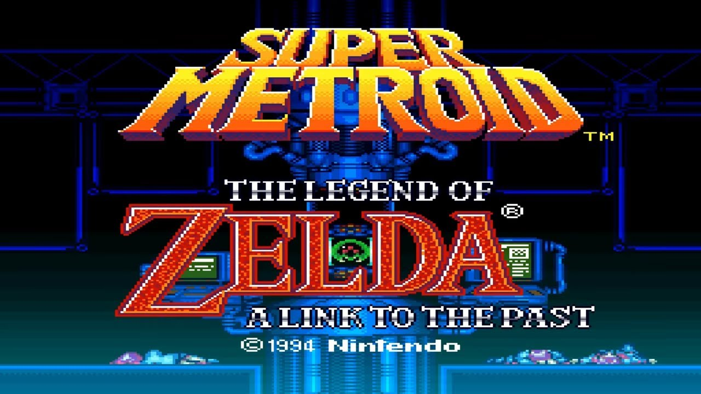
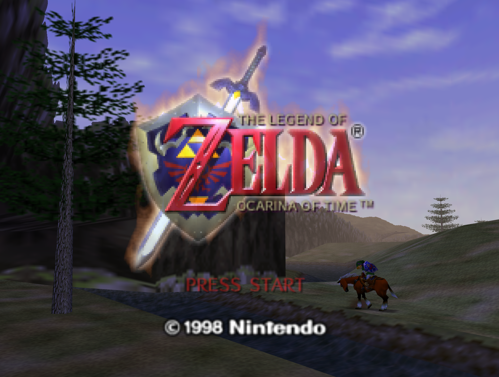
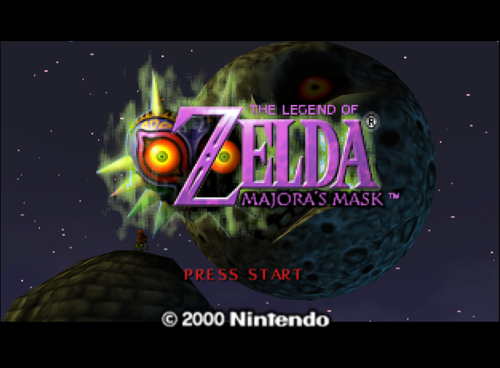

For almost 5 years now, I have been working on a project called [OoTMM](https://ootmm.com) - the **Ocarina of Time & Majora's Mask Combo Randomizer**. I started working on it in a pretty difficult period of my life, and it's been a great source of motivation and accomplishment for me ever since.

But what is a combo randomizer? In fact, what is a video game randomizer at all?

## Randomizers

At its core, a randomizer is a program that takes a video game and shuffles the position of some of its elements, typically items or power-ups, to create a new experience for the player.  
We call the unique, randomized version of the game that is thus produced a *seed*<note>Technically the seed is what was given as an input to the pseudo-random number generator that was used during the randomization, but the analogy stuck.</note>.  

Typically, unless disabled by the user, a proper randomizer ensures that it is still possible to complete the game, even with the shuffled elements. The algorithm and set of rules that enforce this is called *logic* in the randomizer jargon.
Conversely, a seed where this has been disabled is called a *no-logic seed*.

Some games are more suited to randomization than others. Typically, games that have both pretty open environments where progression is gated by acquiring items or abilities are very good candidates. On the other hand, games that are either very open with little gating, or very linear with little opportunities to use items or abilities outside of their intended context are poor candidates.

Some well-known games or series that are commonly randomized include:
- *The Legend of Zelda* series, both the 2D and 3D entries
- *Metroid* series, especially *Super Metroid*
- *Castlevania* series (the metroidvania-style ones)

Perhaps the most popular game to be randomized is *The Legend of Zelda: A Link to the Past*<note>Also known as ALttP or Zelda 3.</note>. The [ALttP Randomizer](https://alttpr.com) has been around for about a decade, and still has regular updates and a very active playerbase.

## Combo Randomizers

A combo randomizer is a specific type of randomizer, where multiple games are combined together and the various items/abilities from all these games are shuffled together.  

Up to the release of OoTMM, there was only a single combo randomizer in existence called [SMZ3](https://samus.link) that combined *Super Metroid* and *A Link to the Past*.

The randomizer builds a single ROM that internally combines both games, and uses clever assembly hacks to allow the player to switch between the two games at predefined locations.  

It plays somewhat differently from a standard randomizer - not only can you obtain items from one game in the other, but there are a total of 4 "connectors" that allow you to switch between the games, at predefined points. This can significantly change the routing, for example, Lower Norfair, a very late-game region in *Super Metroid* that is difficult to access, can sometimes be reached much earlier in SMZ3 by going through a crossover point in *A Link to the Past*'s Dark World.

## OoTMM

OoTMM is the project I created, inspired by SMZ3. I found the concept of combo randomizers very interesting, and wanted to replicate that with two other games. Eventually I settled on *The Legend of Zelda: Ocarina of Time* and *The Legend of Zelda: Majora's Mask*, the two very popular Zelda games on the Nintendo 64.

  
  

The games are pretty similar on the surface - you play as Link, who must explore dungeons, finding important items on the way allowing to solve puzzles and defeat monsters. The main dungeons contain special "quest" items (stones & medallions in Ocarina of Time, boss remains in Majora's Mask) that eventually allow you to reach the final dungeon, defeat the final boss and complete the game. In other words, the classic Zelda formula, Ocarina of Time in particular being very similar to *A Link to the Past* in its structure.

Majora's Mask has a few, fairly unique mechanisms on top of that. The game resolves around masks you can wear<note>There is a small sidequest in Ocarina of Time involving masks as well, but it's extremely basic compared to Majora's Mask.</note>, each giving you specific abilities. A few masks in particular allow you to transform into different forms (Deku, Goron and Zora), each having different abilities.

The other unique mechanism is the 3-day cycle. While Ocarina of Time had a day/night cycle, it only affected a few things, such as some doors being closed at night, or collectibles appearing only at night. In Majora's Mask, the whole game takes place in a 3-day in-game cycle, at the end of which the Moon crashes into the world, forcing a game over. To avoid that, the player can play the "Song of Time" on their ocarina to go back in time, at the start of the first day. This resets most of the world - chests that were open are closed again, NPCs are back at their initial position and forget what you told them or the items you gave them, etc. However, the player retains the major items & masks they have obtained, allowing them to progress further.

This created a challenge for the randomizer - in addition to the technical challenges of creating the combined ROM and programming the actual randomizer, there were also significant design challenges in blending two games, one of which being time-based with a cycle system, and the other having a traditional persistent progression.

On the other hand, Ocarina of Time has one major gameplay element not found in Majora's Mask - time travel. The player starts as a child, but eventually obtains the Master Sword which forwards them 7 years into the future, where Link is now an adult. The world of course is significantly different between the two time periods - the Castle Market for example, the main town in the game, is very living and full of NPCs as a child, but has been overtaken by the forces of Ganon as an adult.

## Design

Very early when making the project, I decided to keep the main mechanics of each game intact, but had to make compromises on a few aspects to make it playable. So Majora's Mask still has the 3-day cycle, but it is paused when you are in Ocarina of Time.  
The player absolutely needs the Ocarina & Song of Time to reset the 3-day cycle. Until they have it, virtually all of Majora's Mask is considered logically inaccessible<note>To ensure that the player doesn't end up in a situation where there are required to obtain an item in Majora's Mask to progress, but are unable to do so because they lack enough time.</note><note>There are a few exceptions - some items that can be obtained in a few seconds when entering Majora's Mask are considered fair game.</note>.

Normally when resetting the 3-day cycle, chests that the player has already opened are closed again, and doors that the player has unlocked are locked again. This is fairly undesirable in a randomizer - the chests could contain items from Ocarina of Time, in which case being re-acquired isn't desirable. Once I decided that chests would remain open, the fact that doors would get locked again became a problem too, as most keys are found in chests. So to provide a playable and uniform experience, I made all of these things permanent instead of cycle-based.

It was also difficult to find good spots to place the crossover points between the two games. Unlike *A Link to the Past* and *Super Metroid*, there are not a lot of "useless" doors that could be hijacked for that purpose in Ocarina of Time and Majora's Mask. I eventually settled on a single crossover point, which is the Happy Mask Shop door in Ocarina of Time and the Clock Tower door in Majora's Mask, because they are thematically linked. Which means it is actually impossible to enter the Mask Shop in OoT and the Clock Tower in MM, so I had to alter a few things to make up for that<note>The masks you get in the mask shop in Ocarina of Time were just placed at random in the item pool instead. The Deku Mask you get in the Clock Tower in Majora's Mask received the same treatment. In Majora's Mask you also learn a song, the Song of Healing, in the Clock Tower at the beginning of the game - to make up for that, the player instead receives a random song when entering Majora's Mask for the first time.</note>.

One significant difference between OoTMM and SMZ3 is that in OoTMM, both games are Zelda games, and thus share a lot of similar items and mechanics, which allowed interesting mechanics to emerge. For example, there is a setting to share identical items - if you enable "Shared Bows" for example, finding a bow gives you the bow in both games. There are also mechanics that are found in one game, but could work in the other, which we ported and placed behind settings. For example, in Majora's Mask the Ice Arrow can create ice platforms on water surface, something that doesn't exist in Ocarina of Time, despite both games having this item. There is a setting to enable this behavior in Ocarina of Time, which opens a lot of new routes.

Check out [part 2](/ootmm-part-02) to learn about the technical implementation.
