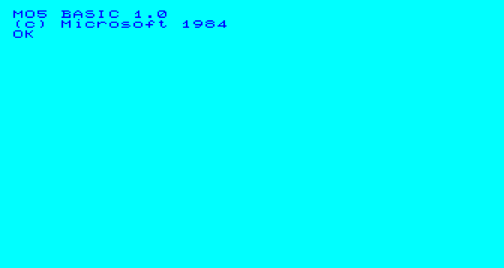

I started programming when I was 8, in the summer of 2005. We were roughtly halfway through the two-month summer holiday we have in France - maybe in early August. I remember it was a sunny day and I was particularly bored. I knew my father released some videogames on [Thomson computers](https://en.wikipedia.org/wiki/Thomson_computers) in the 80s, so I asked him repeatedly to teach me. *Later*, he would say. *It takes time*.  

But on this day, for some reason, he took the time to show me. The Thomson computers of his time were long gone, but he didn't know anything more recent than BASIC 1.0 and 6809 assembly.
He installed a MO5 emulator on my Mac<note>Which was either a Power Macintosh G3 or a Power Mac G4, I cannot remember when I got to the G4.</note>, grabbed his stacks of old BASIC books approximately translated to french, and we started.

---

We were immediately greeted by the MO5 prompt and its dubious color scheme:



My father went over the basics of how to interact with the emulated computer: we would type specially formatted commands in a language called BASIC, and upon pressing enter the computer would execute them. He quickly explained to me the concepts of IO, variables, and strings. We played with `PRINT`, and `INPUT` for a moment.

Then my father explained that we could prefix the commands with *line numbers*. That way, the computer would record them in the order of our choice, ready to be replayed as soon as we execute `RUN`. The `LIST` instruction would show us what we have written so far, again in the correct order.

We then wrote my first program. Here it is, in its original french:

```BASIC
10 PRINT "QUEL EST TON NOM ?"
20 INPUT A$
30 PRINT "BONJOUR " + A$
```

It's basically a slightly more complex version of the classic "Hello, World!" program, that asks for your name and then greets you.  

We tested the program. I typed my name, and the computer replied `BONJOUR MAXIME`. I immediately ran the program again and typed `JACQUES CHIRAC`<note>*Président de la République Française* at the time.</note>, and of course the computer replied `BONJOUR JACQUES CHIRAC`.

To say it was a surreal experience would be an understatement. I made the machine do what *I* wanted - in fact, I taught it it to do it, in a way.
At this moment, *I knew*. This is what I wanted to do for the rest of my life.

---

My father covered flow control with `IF/THEN/ELSE` and `GOTO/GOSUB/RETURN`, a few of the graphical instructions like `BOX/BOXF` and then gave me his programming books for further reading.
There was never a second lesson, but I spent the holidays trying to program things.

Roughtly two years later, I would start being a bit annoyed by the limitations of BASIC<note>Retrospectively a very sane reaction.</note> and would try to learn C, to make native programs.
It was significantly harder. I also barely understood english back then, and had limited access to the internet. I eventually found a french website called *Le Site du Zéro*, with a pretty comprehensive C tutorial. Pointers were hard to grasp, it took me years to fully understand what was going on. Every explanation I found about them was based on little graphics with boxes representing memory, and arrows going from a box to another to represent the pointer. I got that, but I didn't really understand *why* it was useful.

I would also try to learn web programming around that time. Slightly before, I had experimented a bit with HTML and CSS (we didn't have the internet at home yet), and I made one of these horrible color-saturated text over a pure black background pages locally. Eventually we got the internet, and I discovered PHP and MySQL. I ended up making a small gaming website that I administered with a few friends of mine. The website was fairly functional but very lacking in content<note>Some things are timeless.</note>. I had the displeasure of using old school JavaScript to implement a quick chat system - it would just reload the entire page from time to time if you weren't typing a message. The cool kids were using AJAX and jQuery for things like that, but I didn't know how.

It goes without saying, but the entire website was built with a copy-and-paste approach, wasn't stored in any source control system, and was hosted on some shady free hosting service that injected ads (I managed to get rid of the ads with some javascript eventually). I used regular expressions to implement the various emoticons we had, as well as a lite (and buggy) version of BBCode, which was extremely popular at the time.

---

Eventually I realized I was more into system/low level programming, I leveled up my C skills a bit, and I started learning C++. Everyone was into these *classes* and *object* things!  

C++ is a really interesting language. It is complicated to learn. The general consensus nowadays seems to be that prior C experience isn't necessary to learn C++, but I quite strongly disagree.
C++ really is a conceptual superset of C. Only differences in type-safety, a couple keywords and a few divergences with C99 prevents it from being a strict superset.

I remember loving the classes and mostly ignoring templates, especially function templates. Nowadays I would say I do pretty much the opposite. The lack of templates (or something ressembling them) in C hits really hard, and leads to macro abominations, but classes are pretty trivial to emulate if you want to.

The C++ I learnt, C++03, was quite different compared to modern C++. No `nullptr`, no rage-based for loops, no `auto`, no move semantics, no lambdas... Eventually I would learn C++11, probably the biggest update the language ever received. I have not fully caught up with the latest standards yet.

I remember loving the STL, especially coming from C and having re-implemented half-assed versions of `std::vector` in pretty much every project.

This is also the time I started learning about graphical programming. I started learning old-school OpenGL 2.1,
